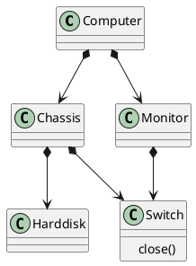
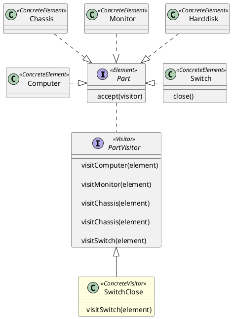

## Visitor(访问者模式)

Visitor 模式, 又称访问者模式。当需要遍历复杂的对象结构，并对该结构中不同类型的对象作不同操作时，可以将 **遍历** 的过程和 **操作对象** 的过程分离，设计为不同的类，这就是 Visitor 模式。

下面通过一个简单的例子演示访问者模式的使用场景。
### 实例演示
#### 问题
假设电脑（Computer）有包括主机箱（Chassis）和显示器（Monitor），主机箱和显示器上都有开关（Switch），主机箱中有硬盘（Harddisk）。需要写一段代码关闭指定电脑`computer`设备上的所有开关。



#### 解决方案 1 （不使用设计者模式）

```
computer.monitor.switch.close()

computer.chassis.switch.close()
```

#### 解决方案 2 （使用设计者模式）




### 优势分析
如果代码需要增加需求，Visitor 模式方便更好的维护方法。

#### 问题

假设电脑（Computer）有包括主机箱（Chassis）和显示器（Monitor），主机箱和显示器上都有开关（Switch），主机箱中有硬盘（Harddisk），硬盘上也有开关。需要写一段代码关闭指定电脑`computer`设备上的所有开关。

#### 修改方案


### 使用场景
Visitor 模式是个中等复杂的模式，如果你的模型具有相对稳定的复杂的结构，经常需要在这个结构中遍历处理，这时候可以考虑使用 Visitor 模式。

在 Visitor 模式中，我们可以抽象出两个参与者
- **Element**
	表示结构中的元素，这是相对稳定的部分，负责遍历结构部分。
- **Visitor**
	表示对结构中元素的访问者，负责对不同类型的对象作不同处理

### 实验代码
